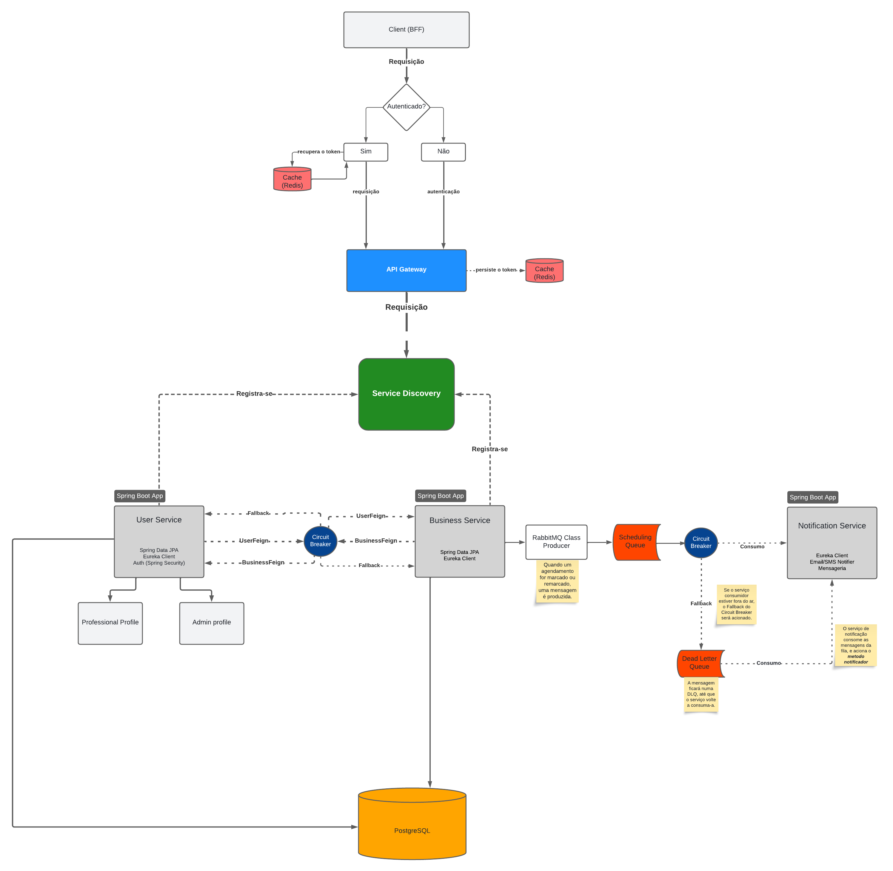
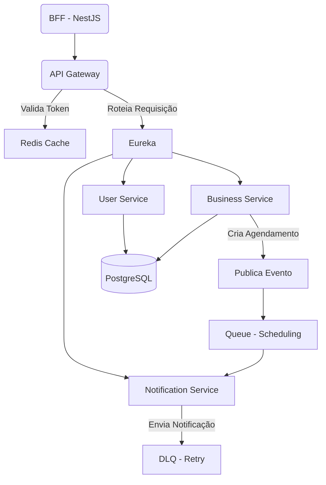

# 💻​ Sistema de Agendamento com Microsserviços (Spring Boot + RabbitMQ + NestJS)

---

## 📌 Visão Geral

Este projeto implementa uma solução de um sistema baseada em microsserviços utilizando Java/Spring Boot dividido em microsserviços, API Gateway para gerenciamento de requisições e um serviço de descoberta (Service Discovery) para garantir que os microsserviços se encontrem. A comunicação entre alguns microsserviços que precisam se comunicar se dá de forma síncrona a partir do Feign Client mas também conta com mensageria e fila com RabbitMQ no microsserviço de notificação. Também foi pensado e implementado um client BFF em NestJS para atuar como fonte de acesso aos serviços, fornecendo uma ponte para a interação com os microsserviços e cache com Redis para armazenamento do token de autenticação JWT.

---

## 🔧 Arquitetura

---

## 🔐 Autenticação

- Autenticação baseada em **JWT**
- Tokens válidos são armazenados em cache via **Redis** para evitar revalidações desnecessárias
- O Gateway intercepta e valida todas as requisições

---

## 🔁 Comunicação entre Serviços

- **Síncrona:** via `Feign Client` com `Circuit Breaker` e `Fallback` para resiliência
- **Assíncrona:** via **RabbitMQ**, com mensagens de eventos sendo publicadas ao criar agendamentos

---

## 📩 Mensageria com RabbitMQ

- O `Business Service` publica eventos de agendamento
- O `Notification Service` consome os eventos e envia mensagens
- Se falhar, a mensagem vai para a **Dead Letter Queue** e é reprocessada após um intervalo

---

## 🧰 Tecnologias Utilizadas

| Camada             | Tecnologia                        |
|--------------------|------------------------------------|
| Backend            | Java 17, Spring Boot, Spring Cloud |
| API Gateway        | Spring Cloud Gateway               |
| Service Discovery  | Eureka                             |
| Mensageria         | RabbitMQ                           |
| Cache              | Redis                              |
| Banco de Dados     | PostgreSQL                         |
| Resiliência        | Resilience4j (Circuit Breaker)     |
| Autenticação       | JWT                       |
| BFF     | NestJS (Node.js)                   |

---

## 🧠 Decisões Arquiteturais

- **Banco único (PostgreSQL):** Para fins de simplicidade no projeto. Em produção, o ideal seria cada serviço possuir seu próprio banco.
- **Mensageria com Dead Letter Queue:** Garante resiliência em cenários assíncronos
- **Circuit Breakers em todas as comunicações síncronas:** Evita falhas em cascata e melhora disponibilidade

---

## ✅ Possíveis Evoluções

- Adição de observabilidade (ex: Zipkin, Grafana, Prometheus)
- Separação de banco por serviço
- Implementação de testes de contrato entre microsserviços
- Notificações via e-mail ou push real

---

## ✒️ Autor

**Daniel Nogueira** - *Desenvolvedor* - [Perfil do Github](https://github.com/NogueiraDan)  
💼 [Meu perfil do LinkedIn](https://www.linkedin.com/in/daniel-nogueira99/)

---
