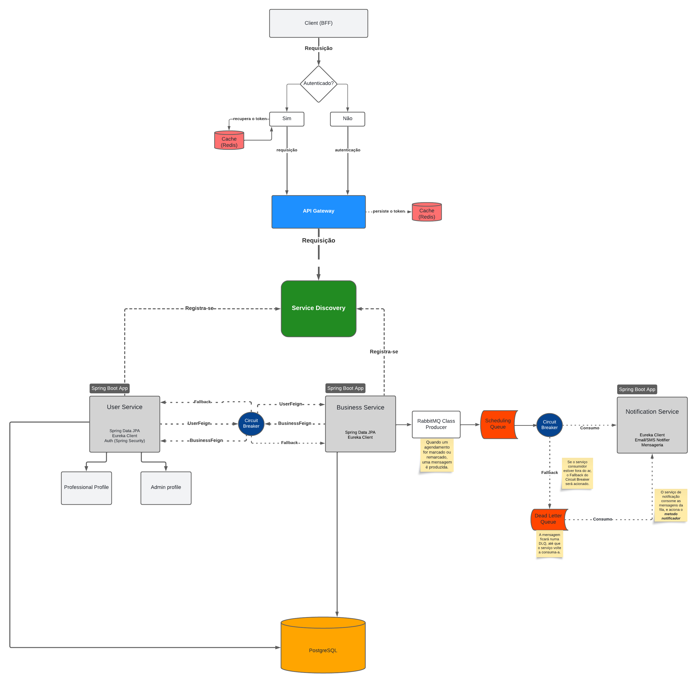
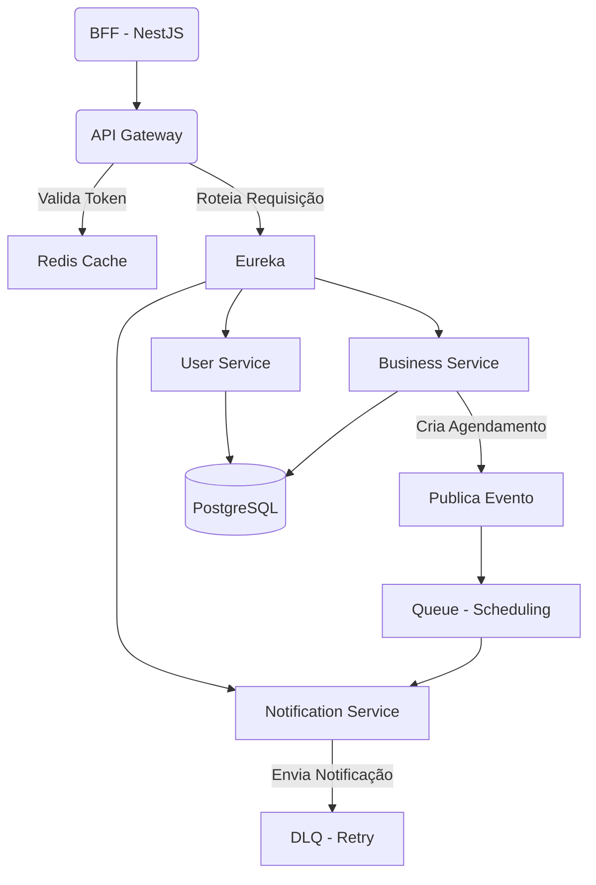
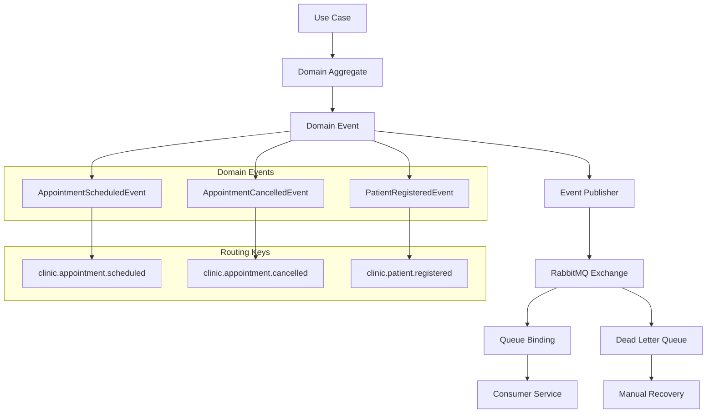

# 💻​ Sistema de Agendamento com Microsserviços (Spring Boot + RabbitMQ + NestJS)

---

## 📌 Visão Geral

Este projeto implementa uma solução de um sistema baseada em microsserviços utilizando Java/Spring Boot dividido em microsserviços, API Gateway para gerenciamento de requisições e um serviço de descoberta (Service Discovery) para garantir que os microsserviços se encontrem. A comunicação entre alguns microsserviços que precisam se comunicar se dá de forma síncrona a partir do Feign Client mas também conta com mensageria e fila com RabbitMQ no microsserviço de notificação. Também foi pensado e implementado um client BFF em NestJS para atuar como fonte de acesso aos serviços, fornecendo uma ponte para a interação com os microsserviços e cache com Redis para armazenamento do token de autenticação JWT.

---

## 🔧 Arquitetura




```mermaid
flowchart TD
    Client(BFF - NestJS) --> Gateway(API Gateway)
    Gateway -->|Valida Token| RedisCache[Redis Cache]
    Gateway -->|Roteia Requisição| ServiceDiscovery[Eureka]
    ServiceDiscovery --> UserService[User Service]
    ServiceDiscovery --> BusinessService[Business Service]
    ServiceDiscovery --> NotificationService[Notification Service]

    BusinessService -->|Cria Agendamento| RabbitMQProducer[Publica Evento]
    RabbitMQProducer --> Queue[Queue - Scheduling]
    Queue --> NotificationService

    NotificationService -->|Envia Notificação| DeadLetterQueue[DLQ - Retry]

    UserService --> PostgreSQL[(PostgreSQL)]
    BusinessService --> PostgreSQL
```

---

## 🔐 Autenticação

- Autenticação baseada em **JWT**
- Tokens válidos são armazenados em cache via **Redis** para evitar revalidações desnecessárias
- O Gateway intercepta e valida todas as requisições

---

## 🔁 Comunicação entre Serviços

- **Síncrona:** via `Feign Client` com `Circuit Breaker` e `Fallback` para resiliência
- **Assíncrona:** via **RabbitMQ**, com mensagens de eventos sendo publicadas ao criar agendamentos

---

## 📩 Sistema de Mensageria e Eventos (RabbitMQ + DDD)

O sistema implementa uma arquitetura orientada a eventos robusta, combinando **Domain-Driven Design (DDD)** com **mensageria RabbitMQ** para comunicação assíncrona resiliente entre microsserviços.

### 🎯 **Arquitetura de Eventos**


```mermaid
flowchart TD
    A[Use Case] --> B[Domain Aggregate]
    B --> C[Domain Event]
    C --> D[Event Publisher]
    D --> E[RabbitMQ Exchange]
    E --> F[Queue Binding]
    F --> G[Consumer Service]
    
    E --> H[Dead Letter Queue]
    H --> I[Manual Recovery]
    
    subgraph "Domain Events"
        C1[AppointmentScheduledEvent]
        C2[AppointmentCancelledEvent]
        C3[PatientRegisteredEvent]
    end
    
    subgraph "Routing Keys"
        R1["clinic.appointment.scheduled"]
        R2["clinic.appointment.cancelled"]
        R3["clinic.patient.registered"]
    end
    
    C --> C1
    C --> C2
    C --> C3
    
    C1 --> R1
    C2 --> R2
    C3 --> R3
```

### 🔄 **Fluxo de Publicação de Eventos**

#### **1. Criação do Evento (Domain Layer)**
```java
// Agregado de Domínio
public class Appointment extends AbstractAggregateRoot<Appointment> {
    public void schedule() {
        this.status = SCHEDULED;
        
        // Registra evento de domínio
        registerEvent(new AppointmentScheduledEvent(
            this.id,
            this.patientId,
            this.professionalId.getValue(),
            this.appointmentTime.getDateTime(),
            this.type.name()
        ));
    }
}
```

#### **2. Publicação do Evento (Application Layer)**
```java
// Use Case
@Service
public class AppointmentUseCaseImpl {
    public AppointmentResponseDto scheduleAppointment(AppointmentRequestDto request) {
        // 1. Criar e agendar
        appointment.schedule();
        
        // 2. Persistir
        Appointment savedAppointment = repository.save(appointment);
        
        // 3. Publicar eventos de domínio
        savedAppointment.getDomainEvents().forEach(event -> {
            if (event instanceof DomainEvent) {
                eventPublisher.publishEvent((DomainEvent) event);
            }
        });
        savedAppointment.clearEvents();
        
        return mapper.toDto(savedAppointment);
    }
}
```

#### **3. Roteamento RabbitMQ (Infrastructure Layer)**
```java
// Publisher
@Component
public class RabbitMQEventPublisher implements EventPublisher {
    public void publishEvent(DomainEvent event) {
        rabbitTemplate.convertAndSend(
            exchangeName,           // "notification.ex"
            event.getRoutingKey(),  // "clinic.appointment.scheduled"
            event                   // AppointmentScheduledEvent
        );
    }
}
```

### 🔀 **Configuração RabbitMQ**

#### **Exchange e Routing**
```java
@Configuration
public class RabbitMQConfig {
    // Exchange único para todos os eventos da clínica
    @Bean
    public TopicExchange clinicExchange() {
        return ExchangeBuilder
                .topicExchange("notification.ex")
                .durable(true)
                .build();
    }
    
    // Binding para agendamentos
    @Bean
    public Binding appointmentScheduledBinding() {
        return BindingBuilder
                .bind(appointmentScheduledQueue())
                .to(clinicExchange())
                .with("clinic.appointment.scheduled");
    }
}
```

#### **Padrões de Routing Keys**
| Evento | Routing Key | Descrição |
|--------|-------------|-----------|
| Agendamento Criado | `clinic.appointment.scheduled` | Novo agendamento confirmado |
| Agendamento Cancelado | `clinic.appointment.cancelled` | Cancelamento de consulta |
| Paciente Registrado | `clinic.patient.registered` | Novo paciente no sistema |
| **Wildcards Suportados** | | |
| Todos agendamentos | `clinic.appointment.*` | Qualquer evento de agendamento |
| Todos eventos | `clinic.*` | Todos os eventos da clínica |

### 🛡️ **Resiliência e Recuperação**

#### **Circuit Breaker + DLQ**
```java
@CircuitBreaker(name = "notification-service", fallbackMethod = "publishEventFallback")
public void publishEvent(DomainEvent event) {
    // Publicação normal
    rabbitTemplate.convertAndSend(exchangeName, event.getRoutingKey(), event);
}

public void publishEventFallback(DomainEvent event, Exception ex) {
    // Fallback: envia para DLQ
    String failureRoutingKey = event.getRoutingKey() + ".failed";
    rabbitTemplate.convertAndSend(exchangeName, failureRoutingKey, event);
}
```

#### **Configuração de Dead Letter Queue**
```java
@Bean
public Queue appointmentScheduledQueue() {
    return QueueBuilder
            .durable("appointment.scheduled.queue")
            .withArgument("x-dead-letter-exchange", "notification.ex")
            .withArgument("x-dead-letter-routing-key", "clinic.appointment.scheduled.failed")
            .withArgument("x-message-ttl", 300000) // 5 minutos
            .build();
}

@Bean
public Queue appointmentScheduledDLQ() {
    return QueueBuilder
            .durable("appointment.scheduled.dlq")
            .withArgument("x-message-ttl", 1800000) // 30 minutos
            .build();
}
```

### 📊 **Fluxo Completo de Recuperação**

```
┌─────────────────┐    Success    ┌─────────────────┐    ┌─────────────────┐
│   Publisher     │──────────────►│    Exchange     │───►│   Target Queue  │
│                 │               │                 │    │                 │
└─────────────────┘               └─────────────────┘    └─────────────────┘
         │                                 │                       │
         │ Failure                         │ Failed Route          │ TTL Exceeded
         ▼                                 ▼                       ▼
┌─────────────────┐               ┌─────────────────┐    ┌─────────────────┐
│ Circuit Breaker │               │   Failed Queue  │    │      DLQ        │
│    Fallback     │──────────────►│  (.failed key)  │───►│  (Manual/Auto)  │
└─────────────────┘               └─────────────────┘    └─────────────────┘
```

### 🎯 **Benefícios da Arquitetura**

#### **Domain-Driven Design**
- ✅ **Domain Events** como first-class citizens
- ✅ **Ubiquitous Language** refletida nas routing keys
- ✅ **Bounded Context** bem definido (`clinic.*`)

#### **Escalabilidade**
- ✅ **Novos consumidores** podem ser adicionados sem impacto
- ✅ **Routing flexível** com wildcards
- ✅ **Evolução independente** de serviços

#### **Resiliência**
- ✅ **Circuit Breaker** para falhas rápidas
- ✅ **Dead Letter Queue** para retry automático
- ✅ **TTL configurável** por contexto

#### **Observabilidade**
- ✅ **Logs estruturados** com routing keys
- ✅ **Métricas** de publicação e consumo
- ✅ **Rastreamento** de eventos através do sistema

---

## 🧰 Tecnologias Utilizadas

| Camada             | Tecnologia                        |
|--------------------|------------------------------------|
| Backend            | Java 17, Spring Boot, Spring Cloud |
| API Gateway        | Spring Cloud Gateway               |
| Service Discovery  | Eureka                             |
| Mensageria         | RabbitMQ + Topic Exchange          |
| Padrões de Evento  | Domain-Driven Design (DDD)         |
| Cache              | Redis                              |
| Banco de Dados     | PostgreSQL                         |
| Resiliência        | Resilience4j (Circuit Breaker + DLQ) |
| Autenticação       | JWT                       |
| BFF     | NestJS (Node.js)                   |

### 🔧 **Detalhamento da Stack de Mensageria**

| Componente | Tecnologia | Função |
|------------|------------|--------|
| **Message Broker** | RabbitMQ | Roteamento e entrega de mensagens |
| **Exchange Type** | Topic Exchange | Roteamento flexível com wildcards |
| **Routing Pattern** | Semantic Keys | `contexto.entidade.acao` |
| **Resilience** | Circuit Breaker + DLQ | Tolerância a falhas |
| **Event Store** | AbstractAggregateRoot | Gerenciamento de eventos de domínio |
| **Serialization** | Jackson JSON | Conversão de eventos para mensagens |

---

## 🧠 Decisões Arquiteturais

### **Infraestrutura**
- **Banco único (PostgreSQL):** Para fins de simplicidade no projeto. Em produção, o ideal seria cada serviço possuir seu próprio banco.
- **Circuit Breakers em todas as comunicações:** Evita falhas em cascata e melhora disponibilidade

### **Mensageria e Eventos**
- **Domain Events + RabbitMQ:** Combinação de DDD com mensageria para desacoplamento total
- **Exchange único com Topic Routing:** Facilita roteamento flexível e adição de novos consumidores
- **Routing Keys semânticas:** Padrão `contexto.entidade.acao` para clareza e wildcard support
- **Dead Letter Queue (DLQ):** Garante resiliência em cenários assíncronos com retry automático
- **AbstractAggregateRoot:** Uso do padrão do Spring Data para gerenciar eventos de domínio

### **Padrões de Design**
- **Arquitetura Hexagonal:** Separação clara entre domínio, aplicação e infraestrutura
- **Domain-Driven Design:** Domain Events como first-class citizens
- **Circuit Breaker Pattern:** Fallback inteligente para DLQ quando serviços estão indisponíveis

---

## ✅ Possíveis Evoluções

### **Observabilidade**
- Adição de observabilidade completa (Zipkin, Grafana, Prometheus)
- Métricas específicas de mensageria (throughput, latência, failed messages)
- Distributed tracing para rastreamento de eventos entre serviços

### **Infraestrutura**
- Separação de banco por serviço (Database per Service pattern)
- Event Sourcing para auditoria completa de eventos
- CQRS (Command Query Responsibility Segregation) para separar leitura/escrita

### **Mensageria**
- Event Store dedicado para replay de eventos
- Saga Pattern para transações distribuídas
- Outbox Pattern para garantir consistência transacional

### **Qualidade**
- Implementação de testes de contrato entre microsserviços (Pact)
- Consumer Driven Contract Testing
- Chaos Engineering para teste de resiliência

### **Funcionalidades**
- Notificações via e-mail, SMS e push real
- Webhooks para integração com sistemas externos
- Event replay para recuperação de dados

---

## ✒️ Autor

**Daniel Nogueira** - *Desenvolvedor* - [Perfil do Github](https://github.com/NogueiraDan)  
💼 [Meu perfil do LinkedIn](https://www.linkedin.com/in/daniel-nogueira99/)

---
